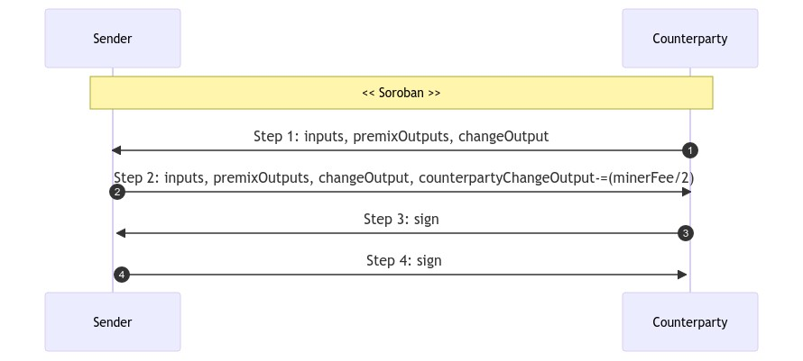

# TXOX2

## I. Usage
- Spender spends to TX0, but shares it with a counterparty rather than broadcasting it immediately
- Counterparty contributes to TX0
- Miner fee shared
- Pool fee shared (based on spender SCODE)
- Premixs shared (max pool.tx0MaxOutputs/2 each)

## II. Cahoots dialog
See [TX0X2Service.java](https://code.samourai.io/whirlpool/whirlpool-client/-/tree/develop/src/main/java/com/samourai/wallet/cahoots/tx0x2/TX0x2Service.java)

#### Step #0: SENDER
Initialize:
- ts: timestamp
- strID: unique identifier
- account: sender account to spend
- fingerprint: sender fingerprint
- type: TX0X2
- params: "testnet" or null

Set:
- step: 0
- poolId: pool ID to spend to
- premixValue: value for each premix output
- maxOutputsEach: max premixs per user (pool.tx0MaxOutputs/2)
- samouraiFeeValueEach: pool fee per user

#### Step #1: COUNTERPARTY
Initialize:
- counterpartyAccount: counterparty account to spend (context.account)
- fingerprintCollab: counterparty fingerprint

Select counterparty inputs to spend:
- value: 
    * if possible, >= maxOutputsEach*premixValue + samouraiFeeValueEach (max possible premixs)
    * otherwise, >= premixValue + samouraiFeeValueEach (only one premix)
- from: counterpartyAccount, SEGWIT_NATIVE
- random selection
- single utxo when possible

Generate counterparty premix outputs:
- value: spendAmount
- to: PREMIX, receive, SEGWIT_NATIVE
- limit: maxOutputsEach

Generate counterparty change output:
- value: sum(sender inputs) - sum (premix outputs) - samouraiFeeValueEach
- to: counterpartyAccount, change, SEGWIT_NATIVE

Set:
- step: 1
- outpoints: append inputs
- psbt: append inputs + premixOutputs + changeOutput
- collabChange: change output address

#### Step #2: SENDER

Generate sender inputs:
- from initial TX0

Generate sender premixs:
- from initial TX0
- limit: to maxOutputsEach

Computes minerFee.

Generate sender change output:
- value: sum(sender inputs) - sum (premix outputs) - samouraiFeeValueEach - minerFee/2
- to: account, change, SEGWIT_NATIVE

Set:
- step: 2
- outpoints: append inputs
- feeAmount: total miner fee (as pair number)
- psbt: 
    * append change output
    * update counterparty change output: deduce feeAmount/2

#### Step #3: COUNTERPARTY

Verify:
- counterparty spends samouraiFeeValueEach + minerFee/2

Set: 
- step: 3
- psbt: 
    * order inputs & outputs with Bip69
    * sign counterparty inputs

#### Step #4: SENDER
Verify:
- sender spends samouraiFeeValueEach + minerFee/2

Set: 
- step: 4
- psbt: 
    * sign sender inputs